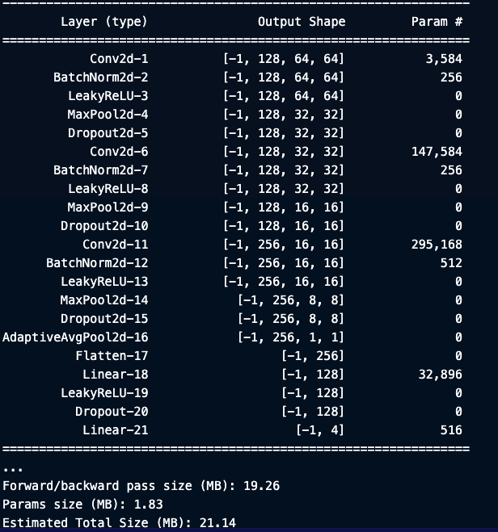
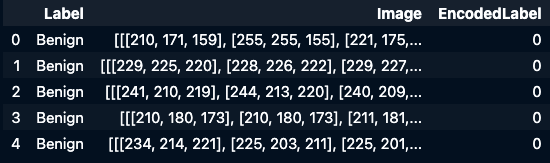
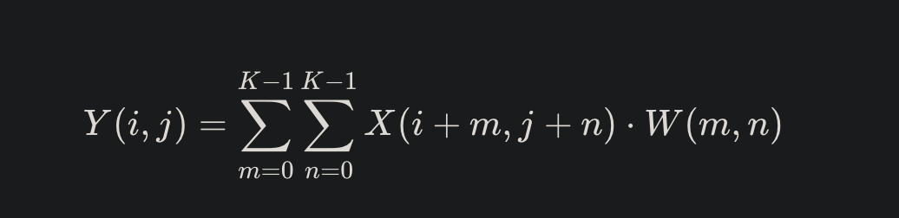
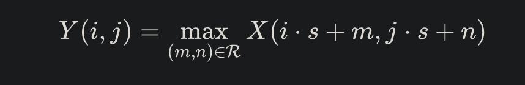

# Wide Convolutional Neural Network

### 📸 Image Preprocessing for Augmented Dataset

This class preprocesses images by applying a range of common augmentations in image recognition. The goal is to make your model more robust and capable of recognizing features in diverse scenarios by creating more diverse data. Currently, we use the following techniques:

- **Gaussian Noise**: Adds random Gaussian noise to 30% of the dataset to simulate natural image variations. 🌧️
- **Flipping**: Generates copies of each image by flipping them over both the horizontal and vertical axes. 🔄
- **Rotation**: Rotates each image clockwise and counterclockwise to introduce orientation variations. ⏰
- **Gaussian Blur**: Adds a blurred version of each original image to enhance texture-based feature learning. 🌫️

### 🛠️ Output

The final output is a Pandas DataFrame where:

- **Column 1**: Contains the processed images as NumPy arrays. 🖼️
- **Column 2**: Holds the labels for each image. 🏷️

## Deep-Wide CNN

### Feature Extraction Mathmatically Explained
The convolution technique we are using may be expressed as

Where the convolution takes place in a sliding frame (i, j), which is crossed multiplied with pixels (M, N) in (K): a predetermined kernal size.

This creates a basic feature map, which is kept to its original size, which introduces the next two subroutines.

### Average Pooling
smoothing pixel intensity.

### Max Pooling
capturing features via pixel intensity

For both formulas, the sliding window (also known as the kernel) moves across the feature map. In average pooling, the average value within this window is extracted by normalizing pixel intensity. In max pooling, the most prominent feature within the window is extracted. 
So, average pooling can be thought of as a smoothing function, while max pooling focuses on extracting the most important feature as defined by pixel intensity.
